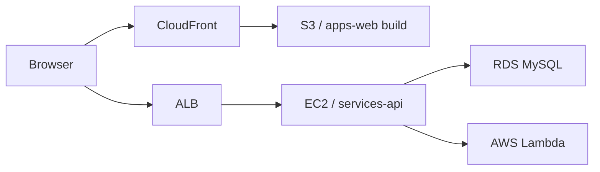

# K-Game


K-Game은 `Daily Word`와 `Prompt Room` 흐름을 중심으로 만든 AWS 기반 웹서비스입니다.  
이 저장소는 단순히 기능만 동작하는 과제용 코드가 아니라, GitHub 공개, 발표, 구조 설명, 운영 관점까지 함께 보여주기 위해 `apps / services / infra / docs / .github` 구조로 정리한 monorepo입니다.

## 한눈 요약

- 프론트엔드: `S3 + CloudFront`
- 백엔드 API: `EC2 + Express`
- AI 처리: `AWS Lambda`
- 데이터베이스: `RDS MySQL`
- 인프라 선언: `Terraform`
- 검증: `GitHub Actions`, `Vitest`, `Jest`, `Terraform validate`

## 왜 이 레포가 보기 좋은가

- 역할이 섞이지 않게 `프론트 / API / Lambda / Infra / Docs`를 폴더 단위로 분리했습니다.
- `.env`, 로그, zip, 빌드 산출물 같은 공개 위험 파일은 Git 추적 대상에서 제외했습니다.
- 평가자용 읽기 순서, 발표 스크립트, 공개 전 체크리스트까지 문서로 따로 정리했습니다.
- CI, Dependabot, CODEOWNERS, CONTRIBUTING, SECURITY 문서까지 넣어 공개 저장소 품질을 보강했습니다.

## 아키텍처



## 폴더 구조

- `apps/web`: Vite 기반 프론트엔드
- `services/api`: Express API, 인증, DB, Lambda 연동
- `services/lambdas`: AI 작업용 Lambda 함수들
- `infra/scripts`: 배포, 점검, 롤백 스크립트
- `infra/terraform`: AWS 인프라 선언
- `docs`: 아키텍처, 배포, 보안, 발표 문서
- `.github`: CI, 이슈 템플릿, Dependabot, CODEOWNERS

## 평가자가 먼저 보면 좋은 문서

1. [평가자 가이드](./docs/evaluator-guide.md)
2. [프로젝트 개요](./docs/project-overview.md)
3. [아키텍처](./docs/architecture.md)
4. [저장소 가이드](./docs/repository-guide.md)
5. [발표 스크립트](./docs/demo-script.md)
6. [공개/발표 체크리스트](./docs/release-checklist.md)

## 빠른 실행

```bash
npm --prefix ./apps/web install
npm --prefix ./services/api install
npm --prefix ./services/lambdas/prompt-engine install
npm --prefix ./services/lambdas/prompt-hint install
npm --prefix ./services/lambdas/word-judge install
npm --prefix ./services/lambdas/word-reply install
```

```bash
npm run dev:web
npm run dev:api
```

## 검증 명령

```bash
npm run build:web
npm run test:web
npm run test:api
npm run test:lambdas
npm run check:api
npm run check:infra
```

## 배포 기준

- S3 업로드 대상: `apps/web/build/*`
- EC2 배포 대상: `services/api/*`
- Lambda 배포 대상: `services/lambdas/<service>`
- Terraform 기준 경로: `infra/terraform`

## 환경 변수 예시 파일

- `apps/web/.env.example`
- `services/api/.env.example`
- `infra/terraform/terraform.tfvars.example`

## 공개 저장소 기준

- 실제 `.env`, 로그, zip, 빌드 산출물은 Git에 올리지 않습니다.
- 문서에는 로컬 절대 경로 대신 상대 경로만 사용합니다.
- 운영 비밀값은 예시 파일과 문서로만 설명하고, 실제 값은 저장소에 포함하지 않습니다.

## 함께 보면 좋은 문서

- [아키텍처 FAQ](./docs/architecture-faq.md)
- [배포 가이드](./docs/deployment.md)
- [보안 체크리스트](./docs/security-checklist.md)
- [문제 해결 가이드](./docs/troubleshooting.md)
- [기여 가이드](./CONTRIBUTING.md)
- [보안 정책](./SECURITY.md)
- [변경 이력](./CHANGELOG.md)
