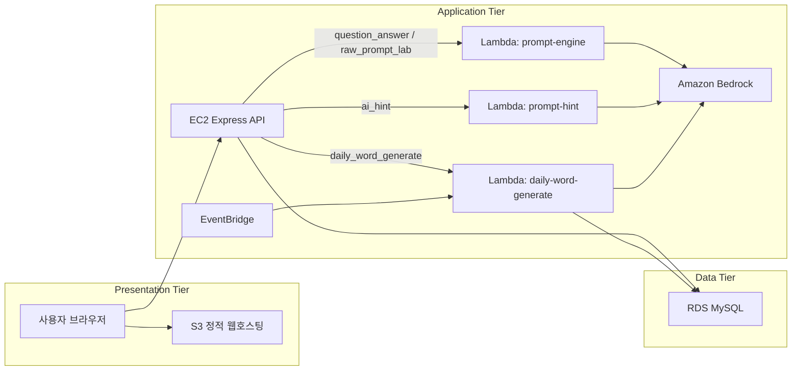

# K-Game


K-Game은 사용자가 `오늘의 단어(Daily Word)`와 `프롬프트 룸(Prompt Room)`에서 AI와 상호작용하며 플레이하는 AWS 기반 3티어 웹서비스입니다.

## 이 프로젝트가 무엇인가

이 프로젝트는 단순 예제 복제가 아니라, 아래 흐름을 직접 기획해서 만든 서비스입니다.

- 게스트로 바로 들어와서 플레이할 수 있는 가벼운 진입 경험
- `오늘의 단어`에서 정답을 추리하는 단어 추론 게임
- `프롬프트 룸`에서 입력 품질을 겨루는 프롬프트 평가 게임
- 관리자 페이지에서 오늘의 단어를 직접 수정하거나 자동 생성하는 운영 기능
- 실시간 질문 응답, 힌트 생성, 배치 자동 생성을 Lambda로 분리한 구조

즉 이 저장소는 "예제 화면을 조금 손본 과제"가 아니라, 기획/화면/백엔드/배포 구조를 다시 잡은 나만의 앱이라는 점을 README에서 바로 이해할 수 있도록 정리했습니다.

## 과제 요구사항 대응 요약

### 1. 나만의 앱인가

네. `오늘의 단어`와 `프롬프트 룸`을 하나의 서비스 안에 묶고, 게스트 진입, 소셜 로그인 보완, 관리자 운영 화면, AI 보조 흐름을 직접 설계했습니다.

### 2. 실제로 동작하는가

네. 프론트, API, Lambda 테스트와 빌드가 분리되어 있고, 게스트 로그인만으로 핵심 흐름을 확인할 수 있습니다.

### 3. README에 무엇이 들어있는가

이 문서에는 아래가 모두 들어 있습니다.

- 이 앱이 무엇인지 한 줄 설명
- 사용한 AWS 리소스 설명
- 로컬 실행 방법
- 평가자가 확인하는 방법
- 현재 Lambda 역할 분리 기준
- Lambda zip을 어떤 파일로 만들고 어떻게 업로드하는지

## 사용한 AWS 리소스

- `S3`
  - 프론트 정적 파일 배포 (S3 정적 웹호스팅)
- `EC2`
  - Express API 서버, 인증, 관리자 기능, 웹 요청 처리
- `AWS Lambda`
  - `prompt-engine`, `prompt-hint`, `daily-word-generate` 중심의 AI/배치 처리
  - Bedrock `amazon.nova-pro-v1:0` 모델 사용
  - EC2에서 Lambda Function URL을 통해 호출
- `EventBridge`
  - 매일 자동 생성 배치 트리거
- `RDS MySQL`
  - 사용자, 게임 기록, 오늘의 단어, 제안 데이터 저장
- `Terraform`
  - 핵심 인프라 선언형 관리

## 왜 Lambda를 여러 개로 나눴는가

이번 구조에서 가장 많이 고민한 지점은 `Lambda를 하나로 뭉칠지`, `역할별로 나눌지`였습니다.

최종적으로는 **실시간 질문 응답 / 힌트 / 자동 생성 배치**를 분리했습니다.

- `prompt-engine`
  - `question_answer`와 `raw_prompt_lab` 처리
- `prompt-hint`
  - 오늘의 단어 AI 단계별 힌트 생성
- `daily-word-generate`
  - 오늘의 단어 자동 생성과 RDS 저장

이렇게 나눈 이유는 아래와 같습니다.

1. 실시간 요청과 배치 작업의 성격이 다릅니다.  
   `prompt-engine`은 사용자 질문에 빠르게 응답해야 하고, `daily-word-generate`는 스케줄 기반 생성과 DB 저장까지 처리하는 배치 작업입니다.

2. 프롬프트 책임을 분리할 수 있습니다.  
   질문 판정/응답 프롬프트와 힌트 프롬프트는 목적과 출력 형식이 달라서, `prompt-engine`과 `prompt-hint`를 분리하는 편이 유지보수와 테스트에 유리합니다.

3. 단어 게임의 실시간 경로를 단순하게 만들 수 있습니다.  
   현재 오늘의 단어 플레이는 예전 2단계 구조가 아니라 `prompt-engine`의 `question_answer` 한 번으로 판정과 캐릭터 반응을 함께 생성합니다.

4. 운영과 발표 설명이 쉬워집니다.  
   "실시간 AI Lambda"와 "매일 자동 생성 Lambda"를 분리해 설명할 수 있어 구조가 더 선명합니다.

## 3티어 아키텍처

- 프레젠테이션 계층: `S3 정적 웹호스팅`
- 애플리케이션 계층: `EC2 + Lambda`
- 데이터 계층: `RDS MySQL`

핵심은 **Lambda가 별도 4번째 계층이 아니라, 애플리케이션 계층 안에서 역할별로 분리된 서버리스 실행 컴포넌트**라는 점입니다.

## 아키텍처 다이어그램



## 디렉터리 구조

- `apps/web`
  - Vite 기반 프론트엔드
- `services/api`
  - Express API, 인증, 세션, DB 접근, Lambda 연동
- `services/lambdas`
  - `prompt-engine`, `prompt-hint`, `daily-word-generate` Lambda
- `infra/scripts`
  - 배포, DB 적용, 헬스체크, 롤백 스크립트
- `infra/terraform`
  - AWS 인프라 선언
- `docs`
  - 평가자, 발표자, 운영자용 문서

## 실행 방법

### 1. 예제 환경파일 준비

다음 예제 파일을 복사해서 로컬 `.env`를 만들고 필요한 값만 채우면 됩니다.

- `apps/web/.env.example`
- `services/api/.env.example`
- `services/lambdas/prompt-engine/.env.example`
- `services/lambdas/daily-word-generate/.env.example`
- `infra/terraform/terraform.tfvars.example`

### 2. 의존성 설치

```bash
npm --prefix ./apps/web install
npm --prefix ./services/api install
npm --prefix ./services/lambdas/prompt-engine install
npm --prefix ./services/lambdas/prompt-hint install
npm --prefix ./services/lambdas/daily-word-generate install
```

### 3. DB 준비

```bash
npm --prefix ./services/api run migrate
```

### 4. 개발 서버 실행

```bash
npm run dev:api
npm run dev:web
```

## 평가자가 확인 방법

- 게스트 로그인은 **평가 및 테스트를 위한 기능**입니다. 운영 환경에서는 비활성화하거나 제거할 수 있습니다.
- 기본 사용자 흐름은 **게스트 로그인만으로 확인 가능**합니다.
- ID 로그인으로 관리자 계정에 접근할 수 있습니다.
- 오늘의 단어에서는 `question_answer` 단일 단계 응답과 AI 단계별 힌트 흐름을 보여줄 수 있습니다.
- 프롬프트 룸에서는 제안, 평가, 점수 저장 흐름을 확인할 수 있습니다.
- 관리자 화면에서는 오늘의 단어 조회, 수정, 자동 생성 재실행을 확인할 수 있습니다.
- `README.md`, `docs/evaluator-guide.md`, `docs/architecture.md`만 읽어도 구조와 배포 방향이 이해되도록 문서를 맞췄습니다.

## 인증 방식

- 프론트엔드(S3)와 API 서버(EC2)가 서로 다른 도메인이므로, 쿠키 대신 **토큰 헤더 방식**을 사용합니다.
- 로그인 시 API가 `sessionToken`을 응답 body에 포함하고, 프론트엔드가 localStorage에 저장한 뒤 `Authorization: Bearer` 헤더로 전송합니다.
- 게스트 세션은 `sessionStorage`에, 소셜/ID 세션은 `localStorage`에 저장되어 새로고침 후에도 유지됩니다.

## 게스트 계정 자동 정리

- API 서버 시작 시, 그리고 24시간 주기로 만료된 게스트 계정을 자동 소프트 삭제합니다.
- 유효한 세션이 남아있는 게스트는 건드리지 않습니다.
- 로그아웃 시에도 게스트 계정은 즉시 비활성 처리됩니다.

## 선택용 테스트용 시드 계정

실제 운영 계정이나 실제 비밀번호는 저장소에 포함하지 않습니다.  
필요할 때만 로컬에서 아래처럼 개발용 시드 계정을 만들 수 있습니다.

```bash
ENABLE_ACCOUNT_SEED=1 \
SEED_TEST_USERNAME=<TEST_USERNAME> \
SEED_TEST_PASSWORD=<TEST_PASSWORD> \
SEED_ADMIN_USERNAME=<ADMIN_USERNAME> \
SEED_ADMIN_PASSWORD=<ADMIN_PASSWORD> \
npm --prefix ./services/api run seed:accounts
```

## Lambda 목록과 역할

### 1. `prompt-engine`

- 오늘의 단어 실시간 질문 응답 생성
- `question_answer`로 판정과 캐릭터 반응을 한 번에 생성
- AI Lab의 `raw_prompt_lab`도 처리
- AI 응답에 정답이 포함되면 자동 차단 후 재시도 (정답 노출 방지)

### 2. `prompt-hint`

- 오늘의 단어에서 AI 단계별 힌트 생성
- 힌트 단계가 올라갈수록 점점 구체적인 힌트를 반환
- 이전 힌트 목록을 참고하여 중복 없는 새 힌트 생성

### 3. `daily-word-generate`

- 매일 오늘의 단어 자동 생성 배치
- Bedrock으로 단어 생성 (연예인, 위인, 일상용어 등 다양한 카테고리)
- RDS 저장과 관리자 수동 재생성 요청 처리

## Lambda zip 패키지 규칙

각 Lambda는 아래 파일만 zip으로 묶어 배포합니다.

- `index.js` (루트 핸들러 shim — 모든 Lambda에 필요)
- `src/`
- `package.json`
- `package-lock.json`
- `node_modules/`

예시:

```bash
npm --prefix ./services/lambdas/prompt-engine install
cd services/lambdas/prompt-engine
zip -r prompt-engine.zip index.js src/ package.json package-lock.json node_modules/
```

각 Lambda의 상세 설명과 업로드 순서는 개별 README에 정리해 두었습니다.

- [prompt-engine README](./services/lambdas/prompt-engine/README.md)
- [prompt-hint README](./services/lambdas/prompt-hint/README.md)
- [daily-word-generate README](./services/lambdas/daily-word-generate/README.md)

## 검증 명령

```bash
npm run build:web
npm run test:web
npm run test:api
npm run test:lambdas
npm run check:api
npm run check:infra
```

## 공개 저장소 주의사항

- 실제 `.env`, 비밀번호, API 키, 배포 후 URL은 저장소에 올리지 않습니다.
- Git에는 `.env.example`만 포함합니다.
- zip 파일, 로그, 로컬 빌드 산출물은 GitHub 제출물에 포함하지 않습니다.
- 문서에는 로컬 절대 경로, 개인 흔적, 개인 연락처를 남기지 않습니다.
- 날짜가 붙은 리뷰 문서는 과거 시점 스냅샷으로 보관하고, 현재 상태 설명은 현재용 README와 `/docs` 기준으로 읽습니다.

## 추가 문서

- [프로젝트 개요](./docs/project-overview.md)
- [평가자 가이드](./docs/evaluator-guide.md)
- [아키텍처 문서](./docs/architecture.md)
- [배포 가이드](./docs/deployment.md)
- [보안 체크리스트](./docs/security-checklist.md)
- [발표 데모 스크립트](./docs/demo-script.md)
