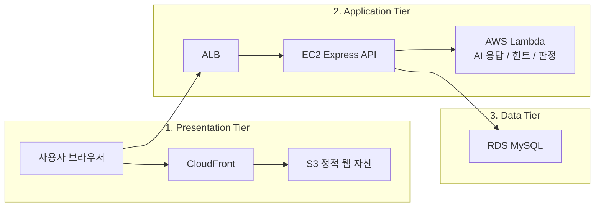

# K-Game


K-Game은 사용자가 오늘의 단어를 맞히고, AI가 생성한 응답과 힌트를 통해 상호작용하는 AWS 기반 3티어 웹서비스입니다.

## 이 프로젝트가 무엇인가

이 프로젝트는 `Daily Word`와 `Prompt Room`이라는 두 흐름을 중심으로 직접 기획한 웹서비스입니다.  
기본 예제를 그대로 복제한 것이 아니라, 게스트 진입, 닉네임 보완, 오늘의 단어 추론, 프롬프트 제안, 관리자 검토 흐름을 하나의 서비스로 엮어 새로 설계했습니다.

특히 화면 구성도 예제 화면을 일부 수정한 수준이 아니라 다음 기준으로 다시 잡았습니다.

- 로그인, 게스트 진입, 닉네임 보완 흐름 분리
- Daily Word와 Prompt Room을 중심으로 한 사용자 동선 재구성
- 로딩, 에러, 빈 상태, 관리자 화면까지 포함한 화면 구조 분리
- `apps / services / infra / docs / .github` 구조의 공개 저장소 기준 정리

## 과제 요구사항 대응

### 1. 나만의 앱

- `Daily Word`와 `Prompt Room`을 핵심 기능으로 직접 기획했습니다.
- 게스트 진입, 세션 쿠키 기반 인증, AI 응답/힌트/판정 분리 구조를 직접 설계했습니다.
- 프론트 화면도 기능 흐름에 맞춰 새로 구성했고, 예제 화면을 부분 수정한 형태로 남기지 않았습니다.

### 2. 실제 동작

- 프론트, API, Lambda, 인프라 검증 명령을 루트에서 다시 실행할 수 있게 정리했습니다.
- 게스트 로그인만으로 기본 사용자 흐름을 바로 확인할 수 있습니다.
- 관리자/계정 검증이 필요할 때만 개발용 시드 계정을 선택적으로 만들 수 있습니다.

### 3. README 필수 항목

- 앱 한 줄 설명: 본 README 첫 문장에 명시했습니다.
- AWS 리소스 설명: 아래 `사용한 AWS 리소스`와 `3티어 아키텍처 설명`에 정리했습니다.
- 실행 방법: 아래 `실행 방법`에 단계별로 정리했습니다.
- 테스트 계정/샘플 데이터: 아래 `평가자 확인 방법`과 `선택형 개발용 시드 계정`에 정리했습니다.

## 사용한 AWS 리소스

- `S3 + CloudFront`
  - 프론트엔드 정적 파일을 배포하는 프레젠테이션 계층입니다.
- `ALB + EC2`
  - Express API를 실행하는 애플리케이션 계층입니다.
- `AWS Lambda`
  - AI 응답 생성, 힌트 생성, 판정 로직처럼 분리 가능한 계산 작업을 처리하는 애플리케이션 계층의 보조 컴포넌트입니다.
- `RDS MySQL`
  - 사용자 정보, 게임 기록, 제안 데이터 등을 저장하는 데이터 계층입니다.
- `Terraform`
  - S3, CloudFront, ALB, EC2, RDS 등 핵심 인프라를 선언형으로 관리합니다.

## 3티어 아키텍처 설명

이 프로젝트는 `프레젠테이션 계층`, `애플리케이션 계층`, `데이터 계층`으로 책임을 분리했습니다.

- 프레젠테이션 계층: `S3 + CloudFront`
- 애플리케이션 계층: `ALB + EC2 + Lambda`
- 데이터 계층: `RDS MySQL`

즉, `S3 / EC2 / Lambda / RDS`를 모두 사용하지만 4티어가 아니라,  
**Lambda를 EC2 API를 보조하는 애플리케이션 계층의 serverless 실행 컴포넌트로 둔 확장형 3티어 구조**로 설명하는 것이 맞습니다.

현재 기준으로는 핵심 네트워크/스토리지/컴퓨트 인프라는 Terraform으로 관리하고, Lambda 배포는 별도 배포 스크립트로 운영합니다.

## 아키텍처 다이어그램



## 폴더 구조

- `apps/web`: Vite 기반 프론트엔드
- `services/api`: Express API, 인증, DB, Lambda 연동
- `services/lambdas`: AI 작업용 Lambda 함수들
- `infra/scripts`: 배포, 점검, 롤백 스크립트
- `infra/terraform`: AWS 인프라 선언
- `docs`: 아키텍처, 배포, 보안, 발표 문서
- `.github`: CI, 이슈 템플릿, Dependabot, CODEOWNERS

## 평가자가 먼저 보면 좋은 문서

1. [평가자 가이드](./docs/evaluator-guide.md)
2. [프로젝트 개요](./docs/project-overview.md)
3. [아키텍처](./docs/architecture.md)
4. [저장소 가이드](./docs/repository-guide.md)
5. [발표 스크립트](./docs/demo-script.md)
6. [공개/발표 체크리스트](./docs/release-checklist.md)

## 실행 방법

### 1. 환경 변수 예시 파일 준비

다음 예시 파일을 복사해 로컬 `.env`를 만든 뒤, 각 환경에 맞는 값만 채웁니다.

- `apps/web/.env.example`
- `services/api/.env.example`
- `infra/terraform/terraform.tfvars.example`

### 2. 의존성 설치

```bash
npm --prefix ./apps/web install
npm --prefix ./services/api install
npm --prefix ./services/lambdas/prompt-engine install
npm --prefix ./services/lambdas/prompt-hint install
npm --prefix ./services/lambdas/word-judge install
npm --prefix ./services/lambdas/word-reply install
```

### 3. API 준비

```bash
npm --prefix ./services/api run migrate
```

### 4. 개발 서버 실행

```bash
npm run dev:api
npm run dev:web
```

## 평가자 확인 방법

- 기본 사용자 흐름은 **게스트 로그인만으로 확인할 수 있습니다.**
- 따라서 별도 실운영 계정 없이도 첫 진입, 로그인, Daily Word, Prompt Room 흐름을 확인할 수 있습니다.
- 관리자/계정 기반 확인이 꼭 필요할 때만 아래 개발용 시드 계정을 선택적으로 생성하면 됩니다.

## 선택형 개발용 시드 계정

실제 운영 계정이나 실제 비밀번호는 저장소에 포함하지 않습니다.  
계정 테스트가 필요할 때만 아래처럼 **로컬 개발용 시드 계정**을 생성할 수 있습니다.

```bash
ENABLE_ACCOUNT_SEED=1 \
SEED_TEST_USERNAME=testuser \
SEED_TEST_PASSWORD=change-me \
SEED_ADMIN_USERNAME=admin \
SEED_ADMIN_PASSWORD=change-me \
npm --prefix ./services/api run seed:accounts
```

## 검증 명령

```bash
npm run build:web
npm run test:web
npm run test:api
npm run test:lambdas
npm run check:api
npm run check:infra
```

## 배포 기준

- S3 업로드 대상: `apps/web/build/*`
- EC2 배포 대상: `services/api/*`
- Lambda 배포 대상: `services/lambdas/<service>`
- Terraform 기준 경로: `infra/terraform`

## 공개 저장소 주의사항

- 실제 `.env`, API 키, 비밀번호, 로그, zip, 빌드 산출물은 Git에 올리지 않습니다.
- `.env` 파일은 `.gitignore`에 포함되어 있고, `.env.example`만 커밋합니다.
- 문서에는 로컬 절대 경로 대신 상대 경로만 사용합니다.
- 운영 비밀값은 예시 파일과 문서로만 설명하고, 실제 값은 저장소에 포함하지 않습니다.

## 함께 보면 좋은 문서

- [아키텍처 FAQ](./docs/architecture-faq.md)
- [배포 가이드](./docs/deployment.md)
- [보안 체크리스트](./docs/security-checklist.md)
- [문제 해결 가이드](./docs/troubleshooting.md)
- [기여 가이드](./CONTRIBUTING.md)
- [보안 정책](./SECURITY.md)
- [변경 이력](./CHANGELOG.md)
